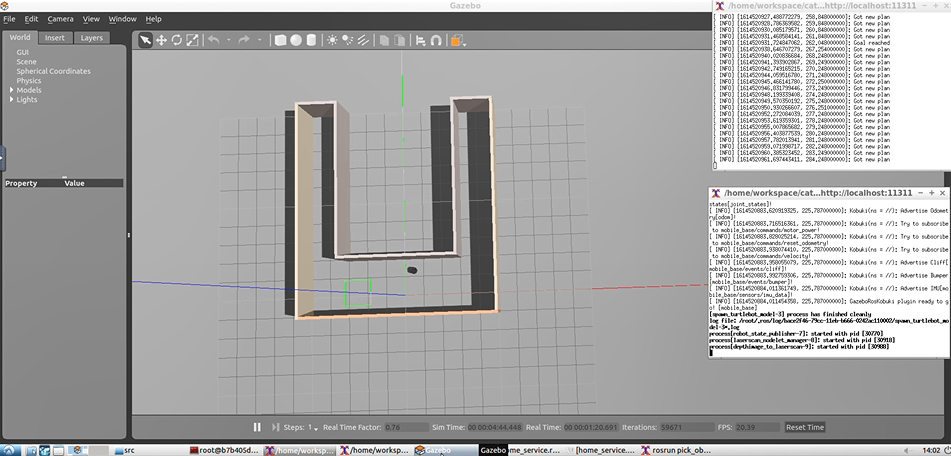
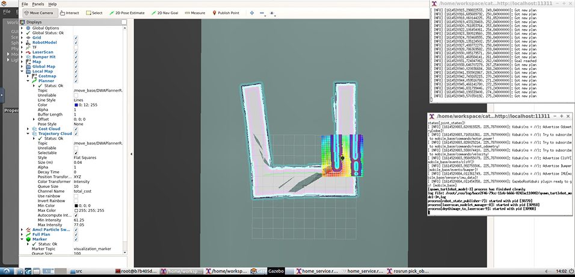

# RoboND-P5-Home_Service_Robot

The goal of this project is to program a robot that can autonomously map and environment and navigate to pick up and dropped virtual objects with ROS Kinetic & Gazebo.  Solution for Udacity Robotics Software Engineer Nanodegree Program




-   Result Link: https://youtu.be/GOLqsiI4hB8

## Prerequisites

### Install xterm, Python with pip, dependencies
```
$ sudo apt-get install xter
$ sudo apt-get install python-pip
$ sudo apt-get update && sudo apt-get upgrade -y
$ sudo apt-get install ros-${ROS_DISTRO}-map-server
$ sudo apt-get install ros-${ROS_DISTRO}-amcl
$ sudo apt-get install ros-${ROS_DISTRO}-move-base
$ sudo apt-get install ros-${ROS_DISTRO}-slam-gmapping
```

### Basic Setting
```
$ mkdir -p ~/catkin_ws/src
$ cd ~/catkin_ws/src
$ catkin_init_workspace
$ cd ..
$ catkin_make
$ sudo apt-get update
$ cd ~/catkin_ws/src
$ git clone https://github.com/ros-perception/slam_gmapping
$ git clone https://github.com/turtlebot/turtlebot
$ git clone https://github.com/turtlebot/turtlebot_interactions
$ git clone https://github.com/turtlebot/turtlebot_simulator
$ cd ~/catkin_ws/
$ source devel/setup.bash
$ rosdep -i install gmapping
$ rosdep -i install turtlebot_teleop
$ rosdep -i install turtlebot_rviz_launchers
$ rosdep -i install turtlebot_gazebo
$ catkin_make
$ source devel/setup.bash
```

## Clone and Initialize

```
$ mkdir catkin_ws && cd catkin_ws
$ git clone https://github.com/studian/RoboND-P5-Home_Service_Robot.git src
$ cd src && catkin_init_workspace
```

## Build the Project (from catkin_ws folder)
```
$ cd ..
$ catkin_make
```

## Run the home_service script
Step 1 is sourcing, 2 is creating permissions and 3 is running the script.
```
1 $ source devel/setup.bash
2 $ chmod 777 ./src/scripts/*.sh
3 $ ./src/scripts/home_service.sh
```

## Running the other scripts

For mapping use:
```
$ cd catkin_ws
$ source devel/setup.bash
$ ./src/scripts/test_slam.sh
```

For navigation testing
```
$ cd catkin_ws
$ source devel/setup.bash
$ ./src/scripts/test_navigation.sh
```
